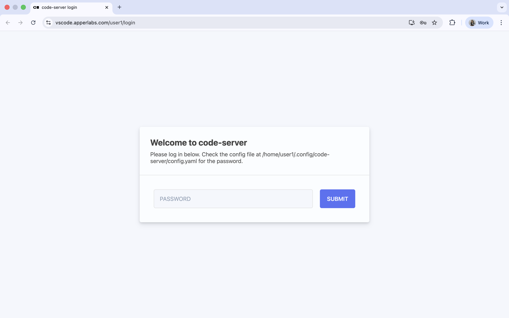
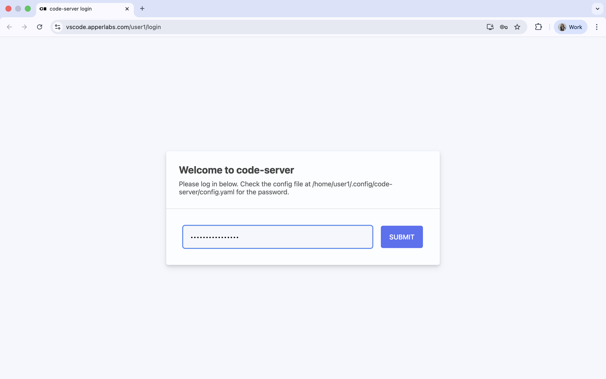
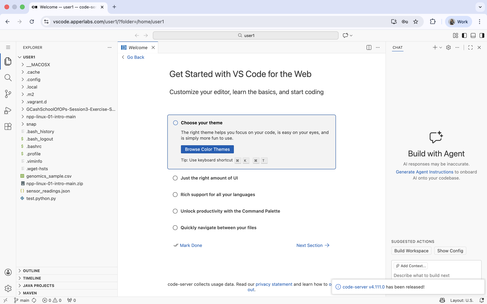
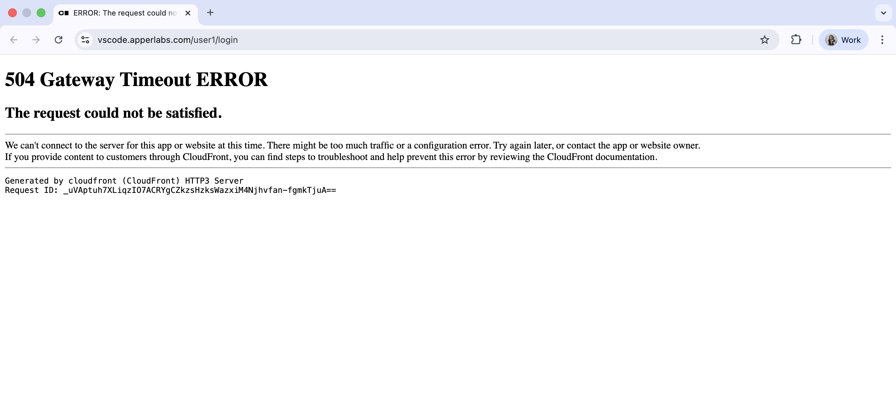
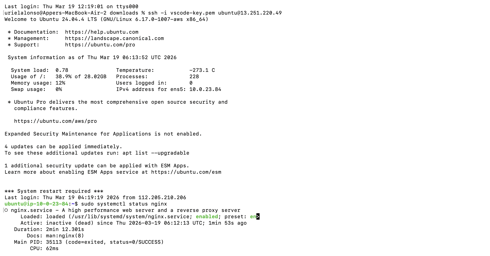
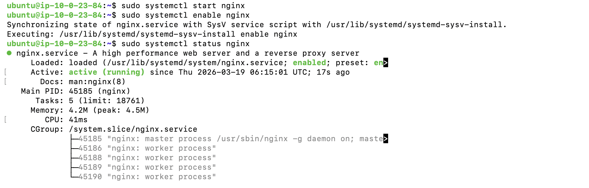

# Accessing Code-Server

This guide explains how to access code-server in your browser, connect to the code-server instance itself, and provides important notes for troubleshooting.

---

## 1. Access URL

Open your browser and navigate to:

```
https://vscode.apperlabs.com/<userX>/
```

Replace `<userX>` with your assigned user number.

Use the following credentials:

- **Username:** userX  
- **Password:** `DevPassword2026!`

Example:
```
https://vscode.apperlabs.com/<user1>/
```



*Note: The Password is `DevPassword2026!`*


---

## 2. Important Note

If you encounter a **504 Gateway Timeout**, it usually means the web server (Nginx) or `code-server` service is down. Follow these steps to resolve it.



### Step 1: Connect to the EC2 Instance

SSH into your EC2 instance:

```bash
ssh -i vscode-key.pem ubuntu@13.251.220.49
```

*Download [vscode-key.pem](https://github.com/apperph/code-server/blob/e92d27702e2c7d0d61bf92a5d3a48f9f3de67759/vscode-key.pem)*

### Step 2: Check Nginx Status

Run the following command to see if Nginx is running:

```bash
sudo systemctl status nginx
```


- **Inactive (dead)** or **Failed** - Nginx needs to be started


### Step 3: Start Nginx

```bash
sudo systemctl start nginx
```

Enable it to start automatically on boot:

```bash
sudo systemctl enable nginx
```



### Step 4: Check `code-server` Status

List all running `code-server` processes:

```bash
ps aux | grep code-server | grep userX
```

If `code-server` is not running, start it manually:

```bash
code-server --bind-addr 0.0.0.0:8080
```

> Adjust port if your configuration uses a different one.


### Step 5: Retry Access

After starting Nginx and ensuring `code-server` is running, refresh your browser:

```
https://vscode.apperlabs.com/<userX>/
```

You should now be able to log in successfully.

Example:
```
https://vscode.apperlabs.com/<user1>/
```


---

### 6. Notes

- Ensure your security group allows **HTTPS (443)** or the port your `code-server` is running on.  
- For multiple users, repeat the same steps for each username.  
- Consider setting up **systemd services** for `code-server` so it automatically starts on boot.
